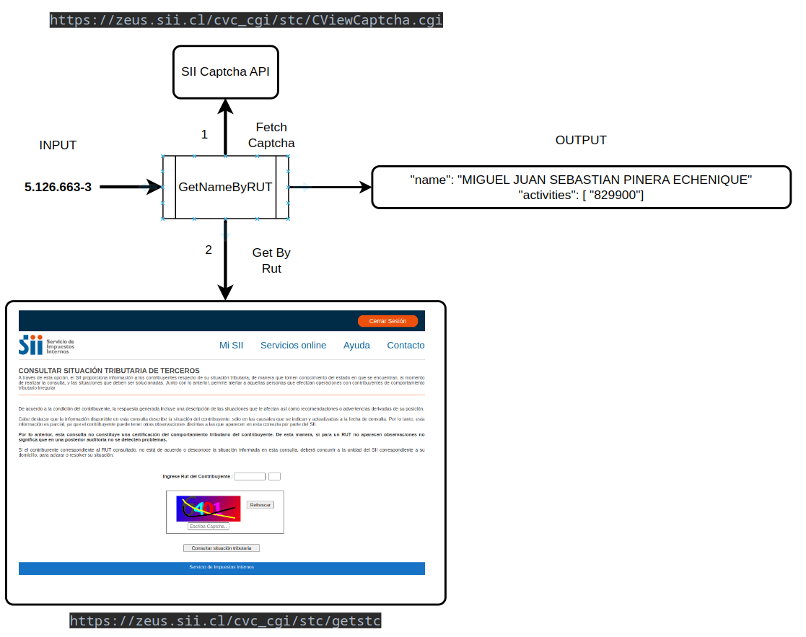

## Chilean RUT Lookup Library (Sii)

This is a Golang library for fetching the name and commercial activities of a Chilean citizen using their RUT (Rol Único Tributario) from the Servicio de Impuestos Internos (SII) of Chile.


### Installation

Use the go get command to install the library:

```bash
go get github.com/Eitol/gosii
```

### Usage

```go
// Print the name of a person given their RUT
package main

import (
	"fmt"
	"github.com/Eitol/gosii"	
	"strconv"
)

func main() {
	rutExample := "5.126.663-3" // RUT de Sebastian Piñera
	ssiClient := gosii.NewClient()
	citizen, err := ssiClient.GetNameByRUT(rutExample)
    if err != nil {
        panic(err)
    }
	fmt.Println(citizen.Name)
	// Output: MIGUEL JUAN SEBASTIAN PINERA ECHENIQUE
	
	fmt.Print(citizen.Activities[0])
	// Output: 829900
	
	// Note: "829900" is the code of "OTRAS ACTIVIDADES DE SERVICIOS DE APOYO A LAS EMPRESAS N.C.P"	
}   
```


### How it Works
The library works by making HTTP requests to the SII's web services and parsing the responses. The flow can be summarized in the following steps:

1- Fetch a captcha challenge from SII's service (necessary for making requests).

2- Send a POST request to SII's service with the provided RUT and the fetched captcha.

3- Parse the HTML response to extract the citizen's name and associated commercial activities.

A crucial step in this process is fetching and solving the captcha challenge. 

To solve the captcha, the library decodes a base64 encoded string provided by SII's service, which includes the captcha solution.



### Note

The Software is provided for academic purposes only. Commercial use is not permitted.
